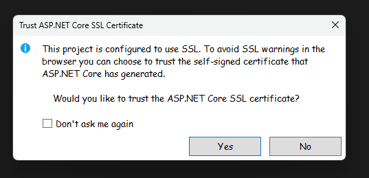
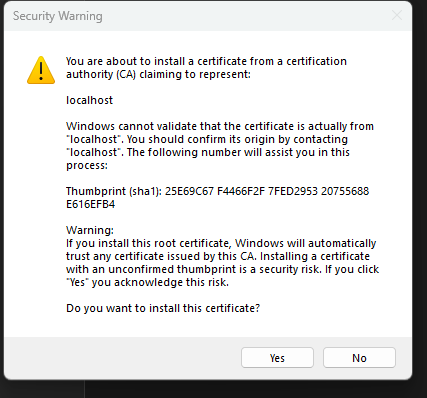
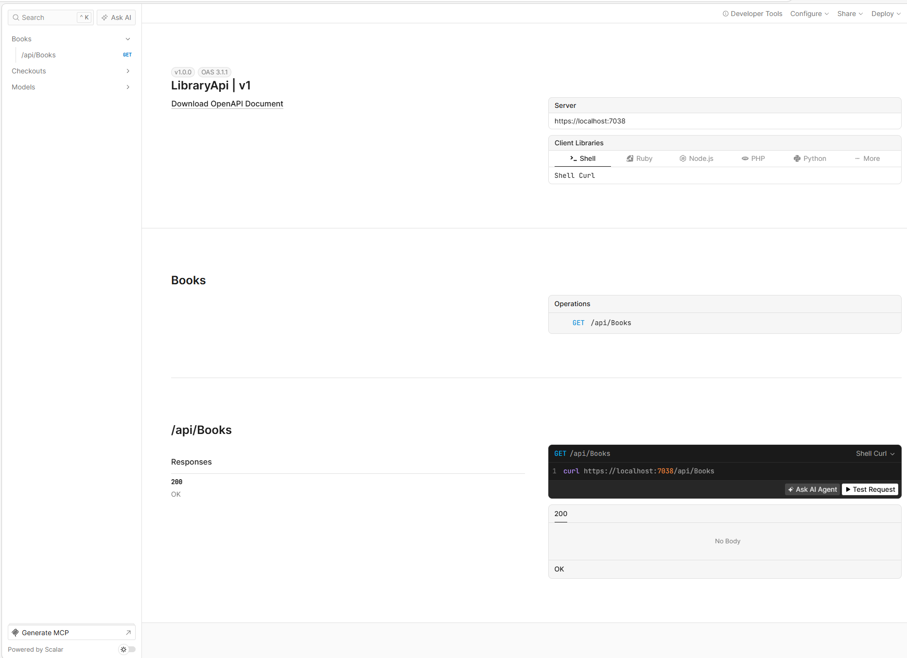

# Reviewer Instructions — Library Book Checkout API

## Prerequisites

- [Visual Studio 2022](https://visualstudio.microsoft.com/) (17.10 or later)
- [.NET 10 SDK](https://dotnet.microsoft.com/download)

No database setup required for v1 — data is held in memory and seeded automatically on startup.

---

## Opening the Solution

1. Clone or unzip the repository
2. Open **`Library.slnx`** in Visual Studio
   > `.slnx` is a new XML-based solution format introduced in VS 2022 17.10. It opens
   > exactly like a traditional `.sln` file.

---

## Running the API

Press **F5** (or **Ctrl+F5**) with the `LibraryApi` project selected.

### First-run SSL prompt

The first time you run an ASP.NET Core project on a machine, you may see this dialog:



Click **Yes**. This trusts a self-signed localhost certificate so the browser doesn't
show a security warning. It is a one-time step that only affects `localhost` on your
machine.

A second Windows security warning will follow immediately:



Click **Yes** here as well. This confirms installing the certificate into the Windows
trusted root store. Both prompts together complete the one-time trust setup.

If you skipped this and see a browser SSL warning, run once in a terminal:
```
dotnet dev-certs https --trust
```

The API will be running at:
- **https://localhost:7038**
- http://localhost:5193

---

## Exploring the API

### Option 1 — Scalar UI (interactive browser explorer)

Navigate to: **https://localhost:7038/scalar/v1**



Scalar is an interactive API explorer (the modern replacement for Swagger UI in .NET 10).
The left sidebar lists all endpoint groups. Click any endpoint to expand it — on the right
you'll see a live code sample and a **"Test Request"** button that fires the request
directly against the running API and shows the response inline.

You can also switch the code sample language (Shell, Ruby, Node.js, PHP, Python) and
download the raw OpenAPI JSON spec via the "Download OpenAPI Document" link at the top.

**"Generate MCP" button (bottom left):**
MCP (Model Context Protocol) is an open standard by Anthropic that lets AI assistants
call external APIs as tools. This button generates the configuration needed for an AI
agent to drive this API directly — no human required. A `v5-mcp` milestone is planned
to demonstrate this in practice.

### Option 2 — Postman collection

A ready-to-use Postman collection is included at `doc/LibraryApi.postman_collection.json`.

**To import into Postman:**
1. Open Postman
2. Click **Import** (top left)
3. Drag and drop `doc/LibraryApi.postman_collection.json` onto the import dialog, or click **files** and browse to it
4. The collection **"Library Book Checkout API"** will appear in your left sidebar
5. The base URL (`https://localhost:7038`) is pre-configured as a collection variable — no setup needed

Run the requests in order (1 through 7) for a complete end-to-end demonstration. Each request has a description explaining what to expect.

**Note:** Postman may warn about the self-signed SSL certificate. If requests fail with an SSL error, go to **Settings → General** and turn off **"SSL certificate verification"** for local testing.

### Option 3 — `.http` file inside Visual Studio

Open **`LibraryApi/LibraryApi.http`** in Solution Explorer. Visual Studio renders a
**"Send Request"** link above each request block. Click it to execute and see the response
in a panel on the right.

---

## Endpoints

| Method | Route | Description |
|--------|-------|-------------|
| GET | `/api/books` | All books with current availability |
| POST | `/api/checkouts` | Check out an available book to a member |
| POST | `/api/checkouts/{id}/return` | Return a checked-out book |
| GET | `/api/checkouts/overdue` | All currently overdue checkouts |
| GET | `/api/checkouts/dashboard` | Summary statistics |

### Sample request — check out a book
```json
POST /api/checkouts
{
  "bookId": 1,
  "memberId": 1
}
```

### Seeded data on startup
- **5 books** (books 1, 3, 5 available; books 2, 4 checked out)
- **3 members**
- **Checkout #1** — already overdue (checked out 20 days ago, due 6 days ago)
- **Checkout #2** — active (due in 9 days)

> State is held in memory. All changes reset when the app restarts.

---

## Progressive Milestones

This solution was built incrementally. Each milestone is a tagged commit in git:

| Tag | What was added |
|-----|----------------|
| `v1-mvp` | Fully functional API with in-memory data store |
| `v2-tests` | xUnit unit test project |
| `v3-database` | EF Core + SQL Server, real persistence |
| `v4-react` | React frontend deployed at rodj.me |

To review any milestone:
```
git checkout v1-mvp
```
